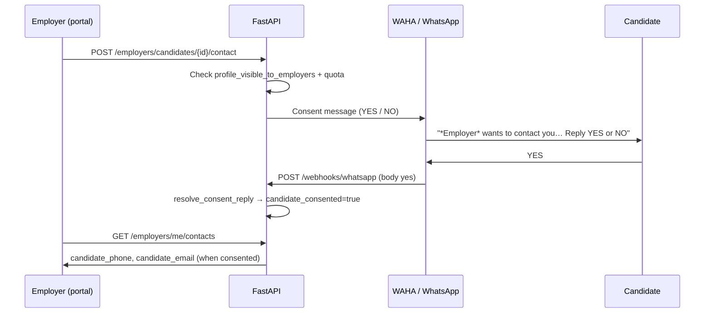

# Employer contact consent (WhatsApp YES / NO)

B2B employers request candidate contact through the employer portal. Phone and email
are **not** shared until the candidate consents on WhatsApp.

## Flow



## Code paths

| Step | Module |
| --- | --- |
| Contact request | `app/services/employer_contact.py` → `create_contact_request` |
| WhatsApp prompt | `send_consent_notifications` → `send_whatsapp_message` |
| Inbound YES/NO | `app/api/v1/webhooks.py` → `resolve_consent_reply` |
| Employer list with PII | `app/api/v1/employers.py` → `list_contacts` + `enrich_contact_row` |

Phone normalization: webhook strips `@c.us` and prefixes `+` (e.g. `260973333333` → `+260973333333`).
The `users.phone` column must match E.164 (`+260XXXXXXXXX`).

## Candidate opt-out

`users.profile_visible_to_employers` defaults to `true`. When `false`, contact requests return
403 and the candidate is excluded from employer search (`employer_search.py`).

Settings UI: **Settings → Privacy → Show profile to employers**.

## Tests

```bash
cd apps/backend && python3 -m pytest tests/test_employer_portal.py::TestEmployerConsent -v
```

Mocks WAHA; uses stateful fake Supabase for consent row updates.
