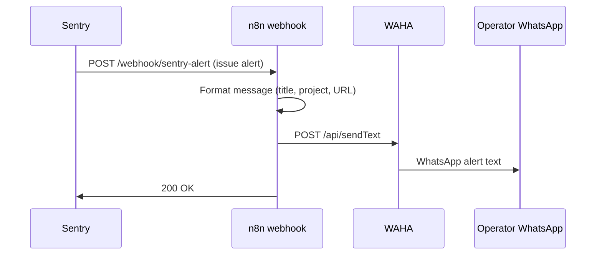

# Sentry → WhatsApp alerts (Wave A.1)

Route Sentry issue alerts to the operator phone via n8n + WAHA. No paid paging services — uses the same WAHA session as OTP and digests.

## Architecture



## Repo export

Workflow JSON: `infra/n8n/sentry_whatsapp_alert.json`

| Node | Purpose |
| --- | --- |
| Sentry Webhook | `POST` path `sentry-alert` |
| Format Alert Message | Parse Sentry payload variants → short text |
| WhatsApp Operator | `WAHA_API_URL/api/sendText` |
| Respond OK | Return `{ "ok": true }` to Sentry |

## n8n setup

1. **Import** `infra/n8n/sentry_whatsapp_alert.json` on `https://automation.vergeo.company`
2. **Env vars** (Settings → Environment):

   ```
   WAHA_API_URL=https://waha.vergeo.company
   WAHA_API_KEY=...
   ADMIN_ALERT_PHONE=+260XXXXXXXXX
   ```

3. **Activate** the workflow and copy the **Production Webhook URL** (test URL only works while the editor listens).

   Example: `https://automation.vergeo.company/webhook/sentry-alert`

4. Confirm WAHA session is `WORKING` (`GET /api/v1/health` → `"waha": true` or `POST /api/v1/admin/waha/bootstrap-session`).

## Sentry alert rule

In Sentry → **Alerts** → **Create Alert** → **Issues**:

1. **When:** an event is seen (or “number of events” ≥ 1 in 1 minute for noisy routes)
2. **If:** optional filters — e.g. environment equals `production`, level ≥ error
3. **Then:** **Send a notification via** → **Webhooks** → paste the n8n production webhook URL

Recommended starter rules:

| Rule name | Filter | Why |
| --- | --- | --- |
| Prod errors | `environment:production`, level error/fatal | Catch real user-facing failures |
| Matches spike | transaction or tag `url` contains `/matches`, ≥5 events/min | Matching regressions (see `PRODUCTION_GAP_ANALYSIS.md`) |

Sentry may send different JSON shapes (legacy `event.alert`, integration-platform `data.issue`, etc.). The n8n **Format Alert Message** node handles all common variants.

## Test fire (verify end-to-end)

### Option A — Sentry UI (preferred)

1. Ensure n8n workflow is **Active** and WAHA is **WORKING**.
2. Sentry → **Settings** → **Projects** → your backend project → **Client Keys (DSN)** — note the project.
3. Trigger a test error on prod (or staging with the same alert rule):

   ```bash
   curl -sS -X GET "https://api.zedapply.com/api/v1/test-error" \
     -H "Host: api.zedapply.com"
   ```

   Only works when `DEBUG=true`; on production use Option B or a one-off `capture_message` in a shell on OCI.

4. Or: Sentry → **Settings** → **Developer Settings** → send a test webhook if configured.

5. Within ~30s you should receive WhatsApp text like:

   ```
   🚨 Sentry error
   Project: zedcv-backend
   Rule: triggered
   RuntimeError: deliberate test error
   Env: production
   https://…sentry.io/issues/…
   ```

6. Check n8n **Executions** — latest run should be green.

### Option B — curl the n8n webhook directly

Simulates Sentry without waiting for an real error:

```bash
curl -sS -X POST "https://automation.vergeo.company/webhook/sentry-alert" \
  -H "Content-Type: application/json" \
  -d '{
    "action": "triggered",
    "data": {
      "issue": {
        "title": "Smoke test — Sentry→WhatsApp",
        "level": "error",
        "web_url": "https://sentry.io/issues/example/",
        "project": { "name": "zedcv-backend" }
      }
    }
  }'
```

Expect HTTP 200 and a WhatsApp message on `ADMIN_ALERT_PHONE`.

### Option C — Sentry CLI / SDK one-liner (OCI)

```bash
docker exec zedcv-backend python -c "
import sentry_sdk
sentry_sdk.init(dsn='YOUR_DSN', environment='production')
sentry_sdk.capture_message('Wave A.1 Sentry WhatsApp smoke test')
"
```

## Troubleshooting

| Symptom | Check |
| --- | --- |
| No WhatsApp | n8n execution log; WAHA `/api/sessions` status; `ADMIN_ALERT_PHONE` E.164 |
| n8n 404 | Workflow not active; using test URL instead of production URL |
| Empty title in message | Inspect execution input JSON; extend **Format Alert Message** for your payload shape |
| Sentry webhook failures | n8n must return 2xx within timeout; **Respond OK** node is required |

## Related

- Health probe: `GET /api/v1/health` includes `sentry_configured`, `waha`, `supabase`, `redis_configured`, `vapid_configured`, `resend_configured`
- Deep email check (Resend domain): `GET /api/v1/admin/email/health` (admin JWT)
- Uptime monitoring: `infra/n8n/UPTIME_MONITORING.md`
