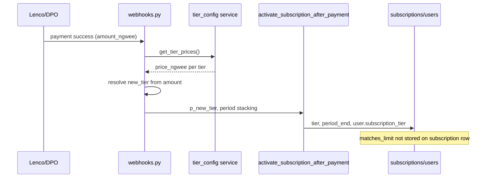

# Tier config audit (2026-06-03)

Audit of how **Admin Tier config** (`public.tier_config`) flows through pricing UI, checkout, webhooks, and match enforcement. Safe code fixes are in PR `cursor/tier-config-audit-fix-9e6a`; larger items below need explicit approval (especially **price** changes).

## Executive summary

| Layer | Driven by `tier_config` DB? | Notes |
| --- | --- | --- |
| Public `/api/v1/tiers` | Yes | Cached in `app/services/tier_config.py`; falls back to `TIER_PRICES` / `TIER_LIMITS` in `app/schemas/subscription.py` if DB empty. |
| `/pricing` plan cards + Lenco amount | Yes | `GET /tiers`; checkout uses `checkout_price_ngwee` when promo active. |
| `/pricing` comparison table (matches row) | Yes (after fix) | Was hardcoded 50/125/Unlimited; now uses same API rows. |
| DPO + Lenco webhooks (tier resolution) | Yes | `get_tier_prices(supabase)` reverse-lookup on `amount_ngwee`. |
| `activate_subscription_after_payment` RPC | Tier name only | Sets `subscriptions.tier` + billing period; **does not** store `matches_limit` on the row. |
| Match quota enforcement | Yes | `get_effective_match_limit()` → `get_tier_limits()` + welcome/referral bonuses. |
| WhatsApp `plan` command copy | Yes | `build_plan_info_by_tier()` (replaces legacy static `PLAN_INFO_BY_TIER`). |
| Bwana FAQ pricing bullets | **No** | Still imports `TIER_PRICES` / `TIER_LIMITS` from `subscription.py`. |
| Homepage / UpgradeButton / `constants.ts` | **No** | Hardcoded K125–K500 and feature bullets in `tier-marketing.ts`. |
| Feature gates (cover letter, prep, etc.) | **No** | `tier_gating.py` / `tier-features.ts` — code-only, not admin-editable. |

**Invariant:** Do not change `TIER_PRICES` in `subscription.py` without maintainer approval; it is the CI-pinned fallback and affects money-adjacent paths when DB is unavailable.

---

## 1. Matrix: `tier_config` → consumers

### 1.1 Database (`public.tier_config`)

| Column | Used for |
| --- | --- |
| `tier` | PK; must be one of `free`, `starter`, `professional`, `super_standard`. |
| `display_name` | Public `/tiers`, superadmin bulk `PUT /admin/tier-config`, WhatsApp display strings. |
| `price_ngwee` | List price; webhook tier mapping; Lenco verify expected amount; MRR admin rollup. |
| `matches_limit` | Match quota (`get_tier_limits`); `99999` = unlimited (Super Standard). |
| `sort_order` | Catalog ordering on `/tiers`. |

Canonical seed values (migrations 053–055): Free K0 / 3 matches; Starter K125 / 50; Professional K250 / 125; Super Standard K500 / 99999.

### 1.2 Code constants (fallback / pins)

| Symbol | Location | Role |
| --- | --- | --- |
| `TIER_PRICES` | `app/schemas/subscription.py` | Fallback prices (ngwee); **pinned by** `tests/test_tier_limits.py`. |
| `TIER_LIMITS` | `app/schemas/subscription.py` | Fallback quotas; same test file. |
| `TIER_MATCH_LIMITS` | `app/core/tier_gating.py` | Legacy duplicate; `get_effective_match_limit` prefers DB via `get_tier_limits`. |
| `PLAN_INFO_BY_TIER` | *(removed)* | Replaced by async `build_plan_info_by_tier(supabase)` in `tier_config.py`. |
| `TIER_DISPLAY` | `app/core/tier_gating.py` | Static labels for renewal reminders (not admin-editable). |
| `TIER_PRICE_KWACHA` | `apps/frontend/src/lib/tier-features.ts` | Upgrade CTAs outside `/pricing`. |

### 1.3 Admin APIs

| Endpoint | Auth | What it updates |
| --- | --- | --- |
| `GET/PUT /admin/tier-config` | Superadmin JWT | Bulk replace all four tiers (incl. `display_name`). |
| `GET/PATCH /admin/tiers/{tier}` | Admin API key or superadmin | `price_ngwee`, `matches_limit` per tier; clears in-process cache. |
| `GET /admin/tiers` | Admin API key or superadmin | Read-only catalog (no user promo fields). |

Admin UI (`TierConfigEditor`) uses **PATCH `/admin/tiers/{tier}`** only (price + matches). Display names require bulk PUT or SQL.

### 1.4 Runtime flow by feature

| Feature | Primary source | Activation / enforcement |
| --- | --- | --- |
| **Frontend `/pricing` cards** | `GET /tiers` → `applyTierConfig()` | Prices/names/match bullet line 0 updated from API. |
| **Frontend comparison table** | `GET /tiers` → `buildTierComparisonFeatures()` | Match row synced with admin (fix in this PR). |
| **Lenco checkout amount** | `checkout_price_ngwee` or `price_ngwee` from `/tiers` | Widget `amount` in kwacha; verify + webhook compare ngwee. |
| **DPO webhook** | `get_tier_prices()` | Exact ngwee → tier; else highest tier ≤ amount. |
| **Lenco webhook** | Same as DPO | Then `activate_subscription_after_payment` RPC. |
| **POST /subscription/verify-payment** | `get_tier_prices()` + `effective_checkout_price_ngwee()` | Validates collection amount vs promo-aware expected price. |
| **Match limits** | `get_tier_limits()` + welcome/referral | `get_effective_match_limit()`; free welcome 7/mo first month (user columns, not `tier_config`). |
| **WhatsApp subscription blurb** | `build_plan_info_by_tier()` | On `plan` / `upgrade` commands. |
| **Invoices / renewal copy** | `get_tier_prices()` | Invoice line amounts; renewal reminders use static `TIER_DISPLAY`. |

### 1.5 Webhook activation (paid tier)

Quota after upgrade comes from **`tier_config.matches_limit`** at read time, not from the payment row.

---

## 2. Drift found and fixes (this PR)

| Issue | Severity | Fix |
| --- | --- | --- |
| `/pricing` comparison table hardcoded 50/125/Unlimited | Medium | `buildTierComparisonFeatures()` reads `/tiers` rows. |
| Plan cards already used `/tiers` | — | No change. |
| Static `plans` / `TIER_MARKETING_FEATURES` remain as SSR fallback | Low | Documented; acceptable offline fallback. |

**Not fixed (documented only):** Bwana FAQ, homepage, `UpgradeButton`, `lib/constants.ts`, `tier-features.ts` price map — still use hardcoded kwacha or schema constants.

---

## 3. Recommended improvements (need approval)

### 3.1 Proration and mid-cycle upgrades

Today, `activate_subscription_after_payment` stacks `current_period_end` when upgrading before period end but does not prorate charges. **Proposal:** store `pending_tier` + credit ledger, or charge delta via Lenco with explicit line items. **Risk:** money flow; requires product rules and webhook tests.

### 3.2 Trial period flag

**Proposal:** `tier_config.trial_days` or per-user `trial_ends_at`; checkout amount K0 until trial ends, then list price. **Risk:** webhook must distinguish trial vs paid amounts; fraud/abuse on free trials.

### 3.3 Feature flags in `tier_config`

**Proposal:** JSONB `features` column (e.g. `cover_letter`, `interview_prep`) consumed by `tier_gating.py` and frontend `tier-features.ts` so marketing gates align with admin without deploy. **Risk:** migration + RLS; invalid JSON breaks gating — needs validation schema.

### 3.4 Single display-name editor in admin UI

Superadmin bulk PUT supports `display_name`; PATCH UI does not. **Proposal:** add display name field to `TierConfigEditor` or route editor to `PUT /admin/tier-config`. **Risk:** low.

### 3.5 Bwana + homepage catalog sync

**Proposal:** load `fetch_tier_config_rows` in `bwana_faq.py` (like `bwana_config.py`) and add `GET /tiers` to homepage client for price blurbs. **Risk:** low; cache TTL same as backend `_cache_rows`.

---

## 4. Smoke checklist after admin tier change

1. `PATCH /admin/tiers/starter` (or superadmin PUT) → `clear_tier_config_cache()` on backend instances (or wait for process recycle).
2. `GET /api/v1/tiers` — confirm new `price_ngwee` / `matches_limit`.
3. `/pricing` — plan cards **and** comparison row match admin values.
4. Test checkout with **exact** new ngwee (promo halved if `promotion_applied_until` active).
5. Complete payment → webhook resolves same tier; `GET /subscription` shows new `matches_limit`.
6. WhatsApp `plan` — text reflects `build_plan_info_by_tier`.

---

## 5. Related files

- Backend: `app/services/tier_config.py`, `app/api/v1/tier_config_routes.py`, `app/api/v1/webhooks.py`, `app/services/lenco_payment_verify.py`, `app/core/tier_gating.py`, `app/schemas/subscription.py`
- Frontend: `app/pricing/page.tsx`, `lib/tier-marketing.ts`, `app/admin/_tabs/TierConfigEditor.tsx`
- Migrations: `037_tier_config.sql`, `053_restore_canonical_tier_model.sql`, `055_free_tier_promo.sql`
- Tests: `tests/test_tier_limits.py`, `tests/test_tier_config_admin.py`, `tests/test_webhooks.py`
