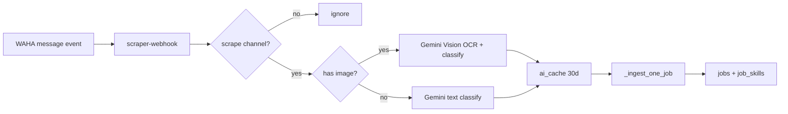

# WhatsApp channel job scraping (Track 4c)

Ingest Zambian job posts from public WhatsApp **channels** (`@newsletter`) into `public.jobs` using the same pipeline as n8n (`POST /api/v1/jobs/ingest`): fingerprint dedup, embeddings, and Wave 2.5 skill resolution.

## Track 4c vs legacy channel ingest

| Path | Env | Webhook |
| --- | --- | --- |
| **Track 4c (this doc)** | `WHATSAPP_SCRAPE_CHANNELS`, `WHATSAPP_SCRAPER_WEBHOOK_TOKEN` | `POST /api/v1/whatsapp/scraper-webhook` |
| Legacy single-channel | `whatsapp_jobs_ingest_enabled=true`, `whatsapp_channel_jobs_id` | Main WAHA webhook in `webhooks.py` |

Use Track 4c for production multi-channel scraping. Keep legacy flags **off** unless you are A/B testing the old single-channel extractor.

**OCR:** Image posters are supported in production (no feature flag). WAHA `hasMedia` + `image/*` → Gemini Vision via OpenRouter; `ocr_text` is stored on `jobs.ocr_source_text`.

## Prerequisites

1. **WAHA session WORKING** — see `AGENTS.md` §3.3. OTP and scraping share the `default` session on OCI (`WAHA_API_URL=http://waha:3000` inside Docker).
2. **Channels joined on the linked phone** — WAHA only receives messages for channels the WhatsApp account already follows. Join via phone, then confirm in WAHA Event Monitor.
3. **Webhook registered in WAHA** pointing at:
   ```
   POST https://<api-host>/api/v1/whatsapp/scraper-webhook
   Header: X-Webhook-Token: <WHATSAPP_SCRAPER_WEBHOOK_TOKEN>
   Events: message
   ```
   Use a **separate** token from `WAHA_WEBHOOK_SECRET` (user OTP / commands webhook).

## Configuration

| Variable | Purpose |
|----------|---------|
| `WHATSAPP_SCRAPE_CHANNELS` | CSV of channel chat IDs, e.g. `120363401234567890@newsletter` |
| `WHATSAPP_SCRAPER_WEBHOOK_TOKEN` | Shared secret for scraper webhook only |
| `OPENROUTER_API_KEY` | Text + vision classification |
| `OPENROUTER_VISION_MODEL` | Default `google/gemini-2.0-flash-001` |
| `WAHA_API_URL` / `WAHA_API_KEY` | Media download + session health |
| `WAHA_SESSION_NAME` | Default `default` |
| `INGEST_API_KEY` | Used by n8n; WhatsApp path calls `_ingest_one_job` directly |

If `WHATSAPP_SCRAPE_CHANNELS` is empty, the webhook returns `ignored` / `no_channels_configured` — safe for deploy before Kaluba supplies IDs.

## Flow



- **Text:** `whatsapp_classifier.classify_whatsapp_text`
- **Image:** download `payload.media.url` → `classify_whatsapp_image` (OCR in `ocr_text`, stored on `jobs.ocr_source_text`)
- **Not a job:** `{is_job: false}` — no DB insert
- **Dedup:** `jobs.whatsapp_message_id` UNIQUE, then `job_fingerprints` SHA-256
- **Source:** `jobs.source = whatsapp_<channel_id>` (column widened to VARCHAR(128) in migration 038)

## Adding a channel

1. Join the channel on the WAHA-linked WhatsApp account.
2. Copy the channel chat id from WAHA Event Monitor (`…@newsletter`).
3. Append to `WHATSAPP_SCRAPE_CHANNELS` on OCI `.env`.
4. `docker compose up -d --force-recreate zedcv-backend` (not `restart` — reload env).
5. Post a test job; check `GET /api/v1/admin/jobs?source=…` or Supabase `jobs` where `source LIKE 'whatsapp_%'`.

## Invalidating classifier cache

Classifier rows use `ai_cache.cache_type = whatsapp_classify`, key prefix `wa_classify_text:` / `wa_classify_img:`, `expires_at` +30 days.

```sql
-- One message body (use SHA-256 of exact text if you know the key)
DELETE FROM ai_cache WHERE cache_key LIKE 'wa_classify_text:%';

-- All WhatsApp classifier cache
DELETE FROM ai_cache WHERE cache_type = 'whatsapp_classify';
```

## Cost estimate

Gemini 2.0 Flash via OpenRouter (~500 tokens/classification):

| Volume | Approx. cost |
|--------|----------------|
| 1 message | ~$0.0001 |
| 1,000 / day | ~$0.10 / day |
| 30,000 / month | ~$3 / month |

Vision (image posters) uses similar per-image pricing; cache hits on reposts are free.

## Smoke test

```bash
cd apps/backend
curl -X POST http://localhost:8000/api/v1/whatsapp/scraper-webhook \
  -H "X-Webhook-Token: $WHATSAPP_SCRAPER_WEBHOOK_TOKEN" \
  -H "Content-Type: application/json" \
  -d '{"event":"message","payload":{"id":"test-1","from":"120363401234567890@newsletter","body":"Hiring: Software Engineer at Tech Co Ltd, Lusaka. Apply: jobs@techco.zm. Python, Django"}}'
```

## n8n job sites (separate from channels)

Site scrapes use workflow **ZedApply Job Scraper** (`rsgZLi6UAcC3lXvu`) → `POST /api/v1/jobs/ingest` with `api_key: $env.INGEST_API_KEY` only. Patch steps: `infra/n8n/README.md` § Job Scraper.

## Tests

```bash
cd apps/backend && python3 -m pytest tests/test_whatsapp_scraper.py -v
```
